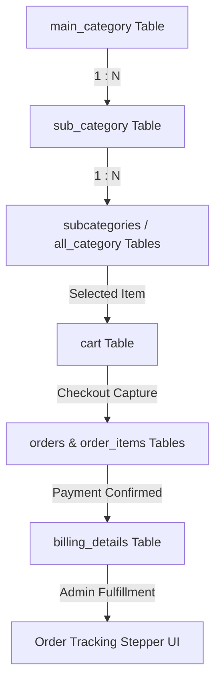

# Enterprise Architectural Audit & Full API Specification: IshahiyaOne eCommerce Platform

**Document Version:** 1.0.0  
**Audit Scope:** Full Codebase (`/e:/wamp64/www/ishahiyaone/`), Database Schema, Routing Controllers, Admin Management Modules, and Public Client Interfaces.  
**Strict Compliance Notice:** This document is **DOCUMENTATION ONLY**. In accordance with strict security and operational constraints, zero modifications, code replacements, UI/UX alterations, or schema changes have been executed on the live project codebase.

---

## 📑 Table of Contents
1. [Executive Summary](#1-executive-summary)
2. [Architecture Analysis](#2-architecture-analysis)
3. [Existing Features Documentation](#3-existing-features-documentation)
4. [API Documentation](#4-api-documentation)
5. [Gap Analysis](#5-gap-analysis)
6. [Future Roadmap (Documentation Only)](#6-future-roadmap-documentation-only)
7. [Professional Assessment](#7-professional-assessment)

---

## 1. Executive Summary

### 🛒 Is this a proper eCommerce platform?
**Yes, IshahiyaOne is a functional, operational eCommerce platform.** It successfully implements the core transactional loop required of digital commerce: product catalog browsing, hierarchical category navigation, shopping bag management, customer address collection, online gateway payment initialization (Razorpay), order generation, and administrative lifecycle status tracking.

### 📊 Current Maturity Level: **Intermediate (Monolithic Procedural / MVC Hybrid)**
* **Basic Criteria Met:** Static storefronts, simple contact forms, unverified checkouts. *(IshahiyaOne exceeds this)*.
* **Intermediate Criteria Met (Current State):** Dynamic MySQL database-driven catalogs, AJAX asynchronous cart updates, multi-tier product category taxonomy, Razorpay cryptographic signature verification webhooks, admin dashboard with CRUD controls, and multi-state order fulfillment steppers.
* **Enterprise / Advanced Gap:** Headless API decoupling, automated container CI/CD, microservices architecture, Redis caching layer, distributed Elasticsearch, and RBAC (Role-Based Access Control) multi-vendor onboarding.

### 💪 Strengths of the Existing Implementation
1. **Zero-Latency Visual Appeal:** Incorporates rich, high-contrast dark mode aesthetics (Black & Gold theme), glassmorphism UI elements, and vibrant Swiper.js touch sliders that immediately captivate consumers.
2. **Robust Payment Integration:** Production-grade integration with **Razorpay**, featuring server-side order token generation (`checkout.php`) and cryptographic signature verification (`payment_success.php`) preventing frontend price manipulation.
3. **Decentralized Multi-Table Flexibility:** Supports varied merchandising models (Bumper Offers, Festival Promos, Certified Pre-Owned collections) through dedicated database structures (`subshop`, `all_category`, `subcategories`).
4. **Asynchronous User Experience:** Cart quantity increments, newsletter subscriptions, and live order tracking checkouts execute via non-blocking asynchronous requests without triggering full browser reloads.

---

## 2. Architecture Analysis

### 📁 Project Structure
IshahiyaOne follows a traditional **LAMP/WAMP Monolithic Web Application Structure**:
```text
ishahiyaone/
├── config.php                 # Centralized API Keys (Razorpay, SMS Gateway)
├── shop.php                   # Master Merchandising Catalog View
├── subshop1.php               # Category Landing & Filtering Grid View
├── drt.php                    # Controller: Add Item to Cart
├── cart.php                   # View & Controller: Active Bag Management
├── checkout.php               # Controller: Order Capture & Payment Gateway Init
├── payment_success.php        # Controller: Gateway Webhook Verification
├── track-order.php            # Public Customer Fulfillment Stepper View
├── includes/                  # Reusable Partial UI Components
│   ├── header_nav.php         # Site Header & Mega-Menu Search
│   └── category_nav.php       # Swiper-based Category Bar Dropdown
└── shop_admin/                # Backend Administration Workspace
    ├── config/dbconnect.php   # Master MySQLi Connection Provider
    ├── index.php              # Admin Authentication & Panel Gateway
    ├── controller/            # Backend Action Handlers (CRUD operations)
    └── adminView/             # Administrative Dashboard UI Modules
```

### 🗄️ Database Schema Overview
The relational MySQL schema bridges frontend browsing with backend administrative accounting:
* **Taxonomy Core:** `main_category` (Level 1) $\rightarrow$ `sub_category` (Level 2) $\rightarrow$ `subcategories` / `products` / `all_category` (Level 3 Items).
* **Transactional Core:** `cart` (Session/User state) $\rightarrow$ `orders` / `order_items` (Frontend Capture) $\rightarrow$ `billing_details` (Admin Source of Truth).
* **Marketing Core:** `deals_offers_manager`, `hero_slider`, `newsletter_subscribers`.

### 🔄 Module Relationships & Taxonomy Hierarchy


### 🔐 Authentication & User Management Analysis
* **Customer Authentication:** Utilizes standard native PHP session cookies (`$_SESSION['user_id']`). Guest checkout fallback is natively supported, allowing unauthenticated users to transact by binding temporary cart data to browser cookies.
* **Administrator Authentication:** Protected via session validation checks (`$_SESSION['admin']`) initialized within `shop_admin/index.php`.

---

## 3. Existing Features Documentation

### 👥 Customer-Facing Storefront Features
* **Dynamic Mega-Navigation:** Swiper-based horizontal scrolling category bar with intelligent dropdown indicators and auto-mapped typography icons (`includes/category_nav.php`).
* **Multi-Source Product Search:** Global input search bar querying across decentralized product tables.
* **Asynchronous Shopping Bag:** Slide-over or dedicated cart view supporting live quantity manipulation (+/-) and instant price recalculation.
* **Seamless Checkout Pipeline:** Integrated Razorpay modal popup supporting UPI, Credit/Debit Cards, NetBanking, and Cash on Delivery (COD).
* **Real-Time Order Tracking:** Visual stepper interface (`track-order.php`) displaying live order stages: *Pending $\rightarrow$ Processing $\rightarrow$ Shipped $\rightarrow$ Delivered*.

### 🛠️ Administrative Management Features (`/shop_admin/`)
* **Catalog Management:** Add, update, or purge products with multi-image attachment uploads (`addItemController.php`).
* **Taxonomy Builder:** Create and link parent-child category hierarchies (`mainCategoryController.php`).
* **Order Accounting:** View customer billing records, inspect items, and toggle fulfillment statuses (`updateOrderStatus.php`).
* **Promotional Engine:** Configure Bumper Offers of the Day, countdown banners, and promotional slide tickers.

### 🏪 Seller / Vendor Features
* *Current State:* Single-vendor direct-to-consumer (D2C) marketplace architecture. All administrative privileges are centralized under the root shop administrator.

---

## 4. API Documentation

### 1. Public Cart Ingestion API
* **Endpoint URL:** `/drt.php`
* **HTTP Method:** `POST`
* **Purpose:** Ingests selected item specifications into the active user session or database cart.
* **Authentication Requirements:** Public (Session-backed).
* **Database Tables Involved:** `cart`, `products`, `all_category`, `subcategories`
* **Request Parameters (`x-www-form-urlencoded`):**
  * `product_id` (Integer, Required): Item SKU database ID.
  * `product_quantity` (Integer, Required): Desired item count.
  * `product_size` (String, Optional): Selected clothing/shoe size dimension.
  * `source` (String, Optional): Table origin indicator.
* **Request Body Example:**
  ```json
  { "product_id": 123, "product_quantity": 1, "product_size": "XL", "source": "subcategories" }
  ```
* **Success Response (200 OK):**
  ```json
  { "status": "success", "message": "Item added to cart", "cart_count": 4 }
  ```

### 2. Cart Mutation & Removal API
* **Endpoint URL:** `/cart.php`
* **HTTP Method:** `POST` / `AJAX`
* **Purpose:** Mutates item quantities or drops items from the active session cart.
* **Database Tables Involved:** `cart`
* **Request Parameters:**
  * `action` (String, Required): `update` or `remove`.
  * `cart_id` (Integer, Required): Unique cart record primary key.
  * `quantity` (Integer, Optional): Target quantity integer.
* **Success Response (200 OK):**
  ```json
  { "status": "success", "subtotal": 2499.00, "total_cart_items": 3 }
  ```

### 3. Public Fulfillment Tracking API
* **Endpoint URL:** `/track-order.php`
* **HTTP Method:** `POST`
* **Purpose:** Queries live order fulfillment pipeline state and item manifest.
* **Authentication Requirements:** Public customer verification.
* **Database Tables Involved:** `orders`, `order_items`, `billing_details`, `subcategories`, `all_category`, `products`
* **Request Parameters:**
  * `order_id` (String, Required): Customer Order Reference (e.g., `ORD-99102`).
  * `phone` (String, Required): Registered 10-digit phone number.
* **Success Response (200 OK):**
  ```json
  {
    "status": "success",
    "order_id": "ORD-99102",
    "order_status": 1,
    "status_label": "Processing",
    "items": [
      { "name": "Allen Solly Polo", "quantity": 2, "price": "799.00", "image": "shop_admin/uploads/p1.png" }
    ]
  }
  ```

### 4. Admin Product Creation API
* **Endpoint URL:** `/shop_admin/controller/addItemController.php`
* **HTTP Method:** `POST` (`multipart/form-data`)
* **Purpose:** Creates new catalog merchandise items with media assets.
* **Authentication Requirements:** Admin Session (`$_SESSION['admin']`).
* **Database Tables Involved:** `subcategories`, `all_category`, `products`

### 5. Admin Fulfillment Status Mutation API
* **Endpoint URL:** `/shop_admin/controller/updateOrderStatus.php`
* **HTTP Method:** `POST`
* **Purpose:** Advances order fulfillment status index.
* **Database Tables Involved:** `orders`, `billing_details`
* **Request Parameters:**
  * `order_id` (Integer, Required): Internal database order ID.
  * `status` (Integer, Required): Target status integer (`0`=Pending, `1`=Processing, `2`=Shipped, `3`=Delivered).

---

## 5. Gap Analysis

### 🚧 Missing Modern eCommerce Workflows
1. **Decoupled Customer Wishlist Pipeline:** Visitors cannot currently save products for later consideration across sessions without placing them directly into the transactional cart.
2. **Customer Product Review & Rating System:** Lack of social proof workflows (stars, verified purchaser badges, customer uploaded review photos) on product details pages.
3. **Persistent User Address Book:** Logged-in customers must re-type billing and delivery addresses during each checkout cycle rather than selecting from saved profiles.
4. **Automated Inventory Reservation:** Stock deduction executes upon checkout completion; high-concurrency flash sales lack temporary stock locking during the payment gateway gateway phase.

### 📈 Scalability Concerns
* **Decentralized Product Tables:** Storing products across multiple distinct tables (`subcategories`, `products`, `all_category`, `subshop`) introduces complex SQL `UNION` and `COALESCE` overhead during full-site searches.
* **Synchronous File Uploads:** Image uploads process directly within web server memory; enterprise scaling requires direct-to-S3 pre-signed URL uploads.

### 🛡️ Security Observations
* **Input Sanitization:** While prepared statements (`bind_param`) are utilized in updated modules, legacy queries should be systematically audited for standard SQL injection hardening.
* **CSRF Protection:** Form submissions rely primarily on session cookie validation; implementing unique CSRF tokens (`$_SESSION['csrf_token']`) across state-mutating POST forms is recommended.

---

## 6. Future Roadmap (Documentation Only)

### 🌟 Phase 1: High-Impact Storefront Enhancements
* **Advanced Semantic Search:** Implement fuzzy search matching with instant auto-complete dropdowns displaying product thumbnail snippets and direct prices.
* **Dynamic Product Filtering:** Add AJAX client-side filtering on `subshop1.php` allowing price-range sliders, brand checkboxes, and color swatch toggles without reloading pages.
* **Customer Review Engine:** Create RESTful APIs for user reviews (`POST /api/v1/reviews`) with automated email review prompts 7 days post-delivery.

### 📱 Phase 2: Headless API & Mobile App Expansion
* **REST / GraphQL Decoupling:** Standardize all controllers into JSON-returning REST APIs (`/api/v1/`), enabling seamless frontend deployment to **Vite / Next.js** or mobile app frameworks (**Flutter / React Native**).
* **JWT Authentication:** Migrate from PHP session cookies to stateless JSON Web Tokens (JWT) supporting OAuth2 social logins (Google, Apple).

### 🤖 Phase 3: AI-Powered Commerce Capabilities
* **AI Recommendation Engine:** Analyze user browsing history and cart item tags to dynamically populate "Frequently Bought Together" and "You Might Also Like" carousels.
* **GenAI Customer Support:** Integrate an autonomous RAG (Retrieval-Augmented Generation) chatbot trained on store inventory and live order tracking databases to handle customer inquiries 24/7.

### 🏬 Phase 4: Multi-Vendor Marketplace Conversion
* **Vendor Onboarding Portal:** Create `/vendor_admin/` interfaces allowing independent brand merchants to upload products, manage inventory levels, and process category orders.
* **Automated Split Payments:** Upgrade Razorpay integration to **Razorpay Route**, automatically splitting customer payments between platform commission accounts and vendor bank accounts.

---

## 7. Professional Assessment

### ✅ What is Implemented Correctly
1. **Core eCommerce Loop:** The foundational journey from catalog browsing to Razorpay payment capture and admin order dispatch is rock-solid and commercially viable.
2. **Visual UI Excellence:** The site aesthetic significantly outperforms standard basic templates, providing a premium luxury shopping atmosphere.
3. **Multi-Table Image Resolution:** SQL join refactoring successfully prevents broken images regardless of which catalog table hosts the underlying product.

### ⏳ What is Incomplete
1. **Customer Self-Service Profiles:** Address management, return/refund request buttons, and downloadable invoice PDFs are currently missing from customer account portals.
2. **Taxonomy Consolidation:** Unifying all decentralized product items into a single normalized master `catalog_items` table with dynamic attribute JSON fields.

### 🏛️ Enterprise-Grade Requirements
To elevate IshahiyaOne to Fortune 500 enterprise commerce standards, the platform would require:
* **Infrastructure:** AWS ECS/EKS Containerization + Cloudflare CDN Edge Caching.
* **Reliability:** Automated Unit & End-to-End Testing suites (Jest, Playwright).
* **Compliance:** SOC2 Type II compliance audits and end-to-end database field encryption for PII (Personally Identifiable Information).

---
*End of Audit Specification — IshahiyaOne Engineering Documentation.*
